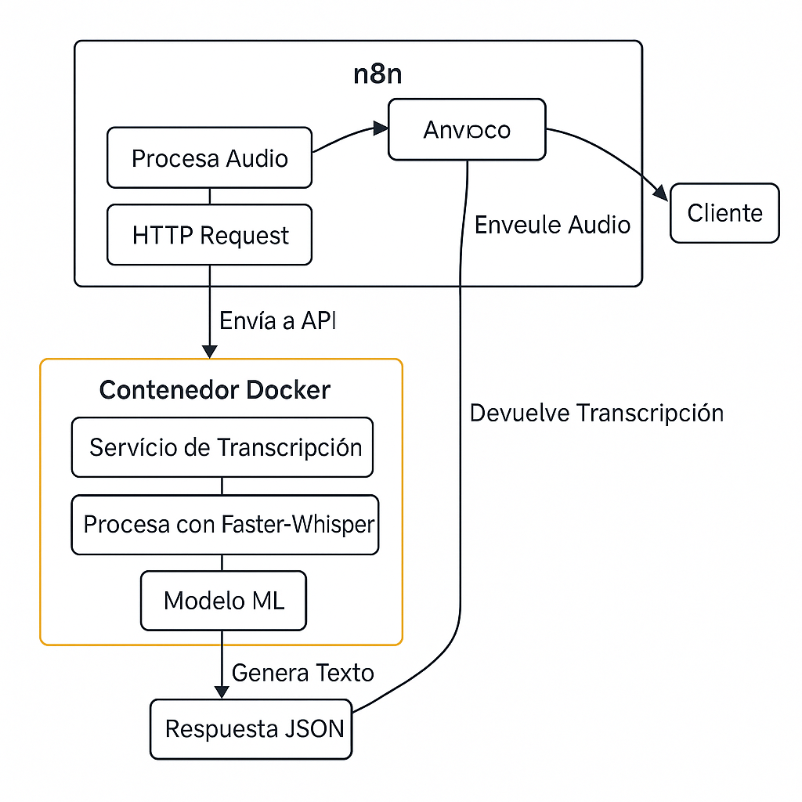

# Proyecto de Transcripción de Audio con Faster-Whisper

Este proyecto implementa un sistema automático de transcripción de voz a texto utilizando `faster-whisper` y n8n. El servicio está diseñado para ser altamente preciso y fácil de integrar con otros sistemas.

## Diagrama del Sistema



Este diagrama muestra el flujo completo del sistema:

1. El cliente envía un archivo de audio al Webhook de n8n
2. El audio es procesado y enviado al servicio de transcripción mediante HTTP Request
3. El servicio, ejecutándose en un contenedor Docker, procesa el audio usando Faster-Whisper
4. El modelo ML genera el texto
5. La respuesta JSON es devuelta al cliente a través de n8n

## Demostración de Uso

### 1. Preparación del Entorno

```bash
# Clonar el repositorio
git clone https://github.com/tu-usuario/proyecto-audio-texto.git
cd proyecto-audio-texto

# Construir y ejecutar el contenedor
docker build -t audio-transcriber .
docker run -d -p 9000:9000 --name transcriber-container audio-transcriber
```

### 2. Configuración en n8n

1. Accede a tu instancia de n8n
2. Crea un nuevo flujo de trabajo
3. Configura los nodos como se describe en la sección "Integración con n8n"
4. Activa el flujo de trabajo

### 3. Prueba del Sistema

```bash
# Ejemplo de uso con curl
curl -X POST -F "data=@audio_example.mp3" http://tu-webhook-url

# Respuesta esperada
{
    "transcription": "Hola, cuéntame, ¿qué síntomas estás teniendo?"
}
```

### 4. Verificación de Precisión

El sistema utiliza el modelo `large-v3` de Whisper, que ofrece:

- Alta precisión en múltiples idiomas
- Detección automática del idioma
- Manejo robusto de acentos y ruido de fondo

## Características

- **Transcripción Rápida y Precisa**: Basado en `faster-whisper`, una implementación optimizada del modelo Whisper de OpenAI.
- **API Sencilla**: Un único endpoint `/transcribe` para enviar archivos de audio y recibir el texto transcrito.
- **Fácil de Desplegar**: Gracias a Docker, puedes levantar el servicio con un par de comandos.
- **Integración con n8n**: Diseñado para ser fácilmente integrable en flujos de trabajo de n8n.

## Requisitos

- [Docker](https://www.docker.com/get-started) instalado en tu sistema.

## Cómo Empezar

Sigue estos pasos para construir y ejecutar el servicio de transcripción.

### 1. Construir la Imagen de Docker

Abre una terminal en el directorio raíz del proyecto y ejecuta el siguiente comando para construir la imagen de Docker. Esto puede tardar un poco la primera vez, ya que necesita descargar la imagen base de Python, las dependencias y el modelo de `faster-whisper`.

```bash
docker build -t audio-transcriber .
```

### 2. Ejecutar el Contenedor

Una vez que la imagen se ha construido, puedes iniciar un contenedor con el siguiente comando:

```bash
docker run -d -p 9000:9000 --name transcriber-container audio-transcriber
```

Este comando inicia el contenedor en segundo plano (`-d`), mapea el puerto 9000 del contenedor al puerto 9000 de tu máquina (`-p 9000:9000`), y le da un nombre al contenedor para que sea más fácil de gestionar.

### 3. Verificar que el Servicio está Corriendo

Puedes verificar que el contenedor se está ejecutando con el siguiente comando:

```bash
docker ps
```

También puedes ver los logs de la aplicación para asegurarte de que el modelo se ha cargado correctamente:

```bash
docker logs transcriber-container
```

Deberías ver un mensaje indicando que el servidor Uvicorn se ha iniciado.

## Integración con n8n

Este servicio está diseñado para integrarse perfectamente con n8n, permitiéndote automatizar la transcripción de audio en tus flujos de trabajo. A continuación, te mostramos cómo configurar un flujo básico de transcripción.

### Configuración del Flujo en n8n

#### 1. Nodo Webhook (Entrada de Audio)

Este será el punto de entrada para tu archivo de audio:

- **HTTP Method**: `POST`
- **Path**: `transcribir-audio` (o el que prefieras)
- **Authentication**: `None`
- **Options**:
  - **Field Name for Binary Data**: `data` (o el nombre que prefieras)
  - **Response Mode**: `Immediately`

El nodo Webhook generará una URL que puedes usar para enviar archivos de audio.

#### 2. Nodo HTTP Request (Transcripción)

Este nodo se conectará con el servicio de transcripción:

- **Method**: `POST`
- **URL**: `http://host.docker.internal:9000/transcribe` (si ejecutas n8n en Docker)
  - O `http://localhost:9000/transcribe` (si ejecutas n8n localmente)
- **Body Content Type**: `Form-Data`
- **Parameter Type**: `n8n Binary File`
- **Name**: `audio_file`
- **Input Data Field Name**: `data0`

### Ejemplo de Configuración Completa

1. **Crear un Nuevo Flujo de Trabajo**

   - En n8n, crea un nuevo flujo de trabajo
   - Añade un nodo Webhook
   - Añade un nodo HTTP Request
   - Conecta el Webhook al HTTP Request

2. **Configuración del Webhook**

   ```
   Method: POST
   Path: transcribir-audio
   Response: Immediately
   Field Name for Binary Data: data
   ```

3. **Configuración del HTTP Request**
   ```
   Method: POST
   URL: http://host.docker.internal:9000/transcribe
   Body Content Type: Form-Data
   Parameter Type: n8n Binary File
   Name: audio_file
   Input Data Field Name: data0
   ```

### Probando el Flujo

1. **Activar el Webhook**

   - Haz clic en "Listen for test event" en el nodo Webhook
   - n8n generará una URL temporal para pruebas

2. **Enviar un Archivo de Audio**

   - Usa la URL generada para enviar un archivo de audio
   - Puedes usar herramientas como Postman o curl:

   ```bash
   curl -X POST -F "data=@audio_example.mp3" http://tu-webhook-url
   ```

3. **Respuesta**
   El servicio responderá con un JSON conteniendo la transcripción:
   ```json
   {
     "transcription": "Hola, cuéntame, ¿qué síntomas estás teniendo?"
   }
   ```

### Consejos y Trucos

1. **Docker y n8n**

   - Si estás ejecutando tanto n8n como el servicio de transcripción en Docker, usa `host.docker.internal` en lugar de `localhost` en la URL.
   - Esto permite que los contenedores se comuniquen entre sí.

2. **Formatos de Audio Soportados**

   - El servicio acepta la mayoría de los formatos de audio comunes (mp3, wav, ogg, etc.)
   - No es necesario convertir el audio antes de enviarlo.

3. **Manejo de Errores**
   - El servicio proporciona mensajes de error descriptivos
   - Revisa los logs del contenedor si encuentras problemas

## Integración con Sistemas Existentes

Este módulo de transcripción está diseñado para integrarse perfectamente con otros sistemas a través de n8n. La integración se puede realizar de varias maneras:

### 1. Integración vía Webhook

El método más directo es usar el endpoint Webhook proporcionado por n8n:

- Envía el archivo de audio al Webhook
- Recibe la transcripción como respuesta JSON
- Procesa el resultado según tus necesidades

### 2. Integración en Flujos de n8n

Puedes incorporar este módulo en flujos de trabajo más complejos:

- Conecta la salida del módulo de transcripción con otros nodos
- Procesa el texto resultante con otros servicios
- Almacena los resultados en bases de datos
- Envía notificaciones basadas en el contenido transcrito

### 3. Ejemplo de Integración

````javascript
// Ejemplo de cómo procesar la respuesta en tu aplicación
async function transcribeAudio(audioFile) {
    const formData = new FormData();
    formData.append('data', audioFile);

    const response = await fetch('http://tu-webhook-url', {
        method: 'POST',
        body: formData
    });

    const result = await response.json();
    return result.transcription;
}

## Endpoint de la API

### POST /transcribe

- **Descripción**: Transcribe un archivo de audio.
- **Request Body**: `multipart/form-data`
  - `audio_file`: El archivo de audio a transcribir.
- **Respuesta Exitosa**: `200 OK`
  ```json
  {
    "transcription": "El texto del audio transcrito aparecerá aquí."
  }
````

- **Respuesta de Error**:
  - `422 Unprocessable Entity`: Si no se proporciona el archivo de audio.

## Para Detener el Contenedor

Si necesitas detener el servicio, puedes usar el siguiente comando:

```bash
docker stop transcriber-container
```

Y si quieres eliminarlo:

```bash
docker rm transcriber-container
```
